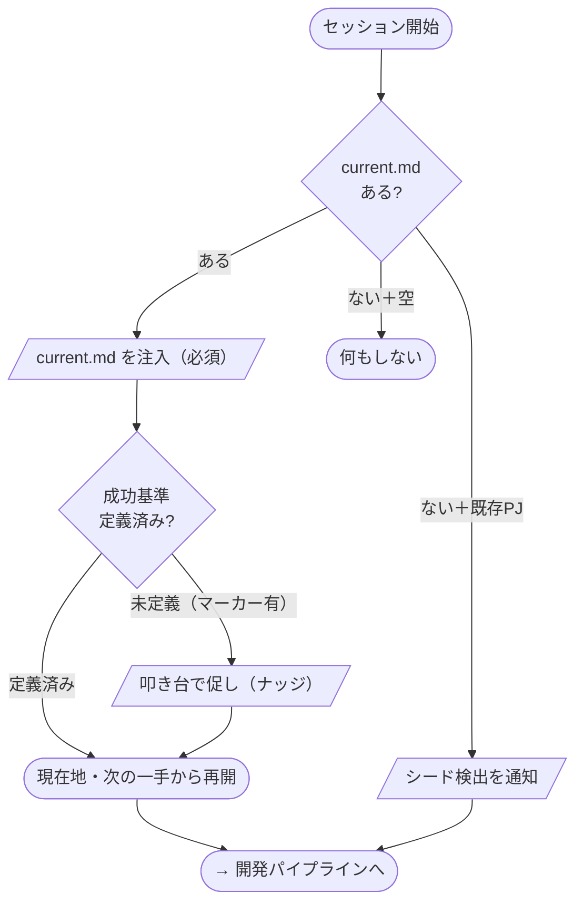
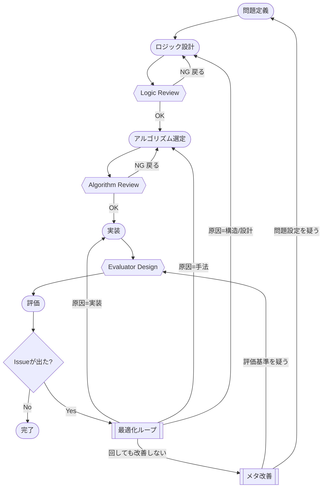

# Engineering Optimization Rules

実装速度ではなく **設計品質** を最大化するための、Claude Code 用の開発規律フレームワーク。
一度グローバルに設定すれば、**すべてのプロジェクトで自動的に効く**。プロジェクトごとの手作業設定は不要。

> 設計の原則: 「ルールを適用するかどうか」を人や AI の判断に委ねない。フックで機械的に発火させ、判断のブレをなくす。

---

## これは何を解決するか

AI とコードを書くとき、つい実装速度を優先して以下が抜け落ちる:

- 問題設定・入出力・責任分割の確認（Logic Review）
- 採用アルゴリズムの比較と選定理由の記録（Algorithm Review）
- 「何を測れば"できた"と言えるか」の定義（Evaluator Design）
- 決定の経緯が残らず、後から場当たりに方針が変わる

このフレームワークは、上記を **フェーズ規律 + 作業ログ + フック** の3点セットで強制する。

---

## 仕組み（3層構成）

| 層 | 場所 | 役割 | 更新主体 |
|----|------|------|----------|
| ルール本体 | `~/.claude/engineering/RULES.md` | フェーズ / 各種 Review / Optimization Loop の規律 | 人（薄く・常時読込） |
| 作業記録 | 各プロジェクトの `.engineering/current.md`・`log.md` | 現在状態（上書き）と決定履歴（追記） | Claude が自動生成・更新 |
| 機械的担保 | `~/.claude/engineering/hooks/*.ps1` | 下記4フックで発火 | — |

### フック

| フック | タイミング | 動作 |
|--------|-----------|------|
| `session-start.ps1` | セッション開始 | `current.md` を文脈に注入。未初期化の既存プロジェクトを検出して通知 |
| `prompt-gate.ps1` | プロンプト送信ごと | 「パイプライン / タスク構成 / アルゴリズムの変更要否」を毎回判断・表示させる |
| `pre-edit.ps1` | Edit/Write 前 | `log.md` の関連履歴を確認させる。初回コード変更時に `.engineering/` を自動生成（ブートストラップ） |
| `post-edit.ps1` | Edit/Write 後 | 決定・評価を `log.md` へ追記、`current.md` を更新させる |

`CLAUDE.md` は `@engineering/RULES.md` の **import 1行のみ**。配布時に各自の個人 `CLAUDE.md` を上書きせず、1行足すだけで導入できる。

---

## 要件

- **Claude Code**
- **Windows + PowerShell**（フックは `powershell.exe` 前提。現状 Windows 専用。macOS/Linux は未対応）

---

## インストール

`~/.claude/`（= `C:\Users\<you>\.claude\`）に対して以下を行う。

### 1. ファイルを配置

このリポジトリの `engineering/` 一式を `~/.claude/engineering/` にコピー:

```
~/.claude/engineering/
├── RULES.md                # ルール本体
├── log-templates.md        # current.md / log.md の書式
└── hooks/
    ├── session-start.ps1
    ├── prompt-gate.ps1
    ├── pre-edit.ps1
    ├── post-edit.ps1
    └── *.txt               # 通知・テンプレート文言
```

### 2. CLAUDE.md に import 行を追加

`~/.claude/CLAUDE.md` に以下の1行を足す（既存の内容はそのまま残してよい）:

```markdown
@engineering/RULES.md
```

### 3. settings.json にフックを登録

`~/.claude/settings.json` の `hooks` に以下をマージする（既存の他フックがあれば配列に追記）:

```json
{
  "hooks": {
    "SessionStart": [
      { "hooks": [{ "type": "command",
        "command": "powershell -NoProfile -ExecutionPolicy Bypass -File \"%USERPROFILE%\\.claude\\engineering\\hooks\\session-start.ps1\"" }] }
    ],
    "UserPromptSubmit": [
      { "hooks": [{ "type": "command",
        "command": "powershell -NoProfile -ExecutionPolicy Bypass -File \"%USERPROFILE%\\.claude\\engineering\\hooks\\prompt-gate.ps1\"" }] }
    ],
    "PreToolUse": [
      { "matcher": "Edit|Write|MultiEdit", "hooks": [{ "type": "command",
        "command": "powershell -NoProfile -ExecutionPolicy Bypass -File \"%USERPROFILE%\\.claude\\engineering\\hooks\\pre-edit.ps1\"" }] }
    ],
    "PostToolUse": [
      { "matcher": "Edit|Write|MultiEdit", "hooks": [{ "type": "command",
        "command": "powershell -NoProfile -ExecutionPolicy Bypass -File \"%USERPROFILE%\\.claude\\engineering\\hooks\\post-edit.ps1\"" }] }
    ]
  }
}
```

> パスは環境に合わせて調整。`%USERPROFILE%` が展開されない場合は絶対パス（`C:\Users\<you>\.claude\...`）を直書きする。

### 4. Claude Code を再起動

新しいセッションを開始すると、`session-start` フックが発火し、`current.md` が文脈に注入される。

---

## 使い方

導入後は特別な操作は不要。Claude が非自明なタスクに着手するときに自動で:

1. **着手前** — 変更要否（アルゴリズム/パイプライン/タスク）を1行表示
2. **コード変更前** — `log.md` の関連履歴を確認
3. **コード変更後** — 決定・評価を `log.md` に追記、`current.md` を更新

`.engineering/` が無いプロジェクトでは、最初のコード変更時に自動生成される（ブートストラップ）。
README・docs・`git log` のある既存プロジェクトは、初回にシードを提案してくる。

### 各プロジェクトに生成されるもの

```
<your-project>/.engineering/
├── current.md   # 今の状態（問題定義 / 採用方針 / 進行中タスク / 最新評価）— 上書き更新
└── log.md       # 決定・評価の履歴 — 追記のみ。見出しは「YYYY/MM/DD HH:mm | 領域タグ | サマリ」
```

`.engineering/` はプロジェクトにコミットしてチームで共有してもよいし、`.gitignore` して個人用にしてもよい。

---

## ルールの全体像

`RULES.md` が定義するフェーズ（評価までの**5つ**）:

```
Problem Definition → Logic Design → Algorithm Selection
→ Implementation → Evaluation
```

各フェーズの出口/入口につく**ゲート**（確認）:

- **Logic Review** — 問題設定 / 入出力 / 工程分割 / 責任分離を実装前に確認
- **Algorithm Review** — 他手法と精度・速度・コスト・拡張性を比較し、選定理由を残す
- **Evaluator Design** — correctness / quality / performance / maintainability を評価前に定義。**測れないものは「未評価」と明記し、「できた」と言わない**

フェーズに重なる**ループ層**（評価結果を受けて前段へ戻る運動。順に通るフェーズではない）:

- **Optimization Loop** — 症状→原因→影響工程→改善案→変更→再評価を局所改善で回す
- **Meta Improvement** — 改善しないときは評価基準自体を疑う

詳細は [`engineering/RULES.md`](engineering/RULES.md) を参照。

---

## 全体フローと用語

図は2枚に分ける。**起動フロー**＝フックが実際に行う決定木（実装と1:1）。**開発パイプライン**＝守るべき思考の順序（規範の地図・フックは重ねない）。

### 起動フロー（SessionStart の決定木・実装と1:1）



### 開発パイプライン（規範の地図・フェーズ / ゲート / ループ層）



> Mermaid の表示: VS Code 拡張「Markdown Preview Mermaid Support」／https://mermaid.live ／GitHub 上は自動描画。
> フックの発火点は開発パイプライン図に**重ねず**、上の「フック」表で対応づける（フェーズはフックではなくハーネスのイベント＝起動・プロンプト・編集で発火する）。

| 形 | 種類 | 意味 |
|---|---|---|
| 角丸 | **フェーズ**（5つ） | 一度・前向きに進む段階 |
| 六角形 `{{ }}` | **ゲート** | 次へ進む前の確認。NGなら手前へ戻る |
| 二重枠 `[[ ]]` | **ループ層** | 評価結果を受けて後ろへ戻る運動（フェーズではない） |
| ひし形 | **分岐** | 条件による枝分かれ |
| 平行四辺形 `[/ /]`（点線） | **フック** | 人/AIの判断によらず機械的に発火（起動フロー図のみ） |

> **自明なタスクは通さない**: 一行修正・単純な質問など自明なものは、この開発パイプライン全体を通さず実装へ直行してよい（RULES 冒頭）。図は非自明タスクの規範。

**2つのレベルを区別する**（用語混乱の元）:

- **メタ＝どう作るか**（開発の進め方）。RULES の「フェーズ」はこちら。
- **対象＝何を作るか**（成果物の構造）。**変更要否ゲートの「パイプライン／アルゴリズム」は対象側**（成果物の構造＝大／手法＝中）を指す。「タスク」は作業構成（小）。

**用語**:

| 語 | 意味 |
|---|---|
| 問題定義 → ロジック設計 → アルゴリズム選定 → 実装 → 評価 | 開発の5フェーズ（メタ側の進行順） |
| Logic / Algorithm Review, Evaluator Design | 各フェーズの出口/入口の確認（ゲート） |
| 最適化ループ / メタ改善 | 評価後に前段へ戻るループ層。局所改善を優先し、回しても改善しなければ評価基準・問題設定を疑う |
| current.md | 今の状態（上書き）。問題定義・成功基準・優先順位・採用方針・現在地・最新評価 |
| log.md | 決定・評価の履歴（追記のみ）。見出しの領域タグで grep して必要箇所だけ読む |

**成功基準の促し（予約マーカー `@ENG:UNSET@`）**: current.md の「成功基準（完了の定義）」「優先順位 / WIP上限」が未記入のあいだは、その行に予約マーカー `- @ENG:UNSET@` が置かれる。これが残っていると SessionStart（再開時）と PreToolUse（編集直前）が「Claude が叩き台を出してユーザーに確認せよ」と促す（ブロックでなく促し）。確定したら該当欄を書き換える。検知は**マーカー単独行のみ**を対象にするため、本文や説明文でマーカーに言及しても誤検知しない。

---

## 既知の制約

- **Windows / PowerShell 専用** — macOS・Linux 用のシェル版フックは未実装
- **インストールは手動** — settings.json マージ・パス調整・import 行追加を行うインストーラは未提供（TODO）
- フックの発火頻度・通知文言は調整余地あり（`hooks/*.txt` を編集すれば文言を変えられる）
