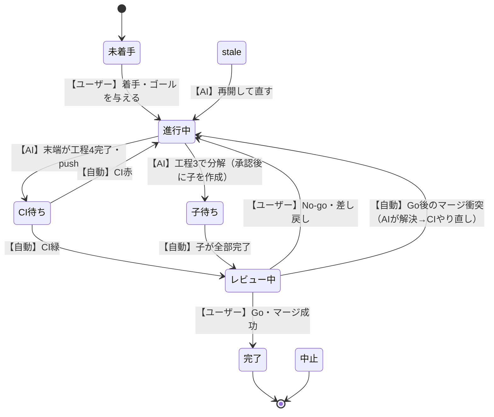

# 新フロー仕様（確定分）

作り直し版のAI開発フロー。**全体の骨格（工程1〜5）**→各工程の詳細→ノードの記録テンプレート→ステータス（状態）設計→実行環境（駆動スタック）→実運用（git・GitHub）の設計、の順に示す。設定時に確認するだけの細目は末尾「まだ決めていないこと」に明示。
（旧 FLOW.md は"作り直し前の旧システムの棚卸し"。本書が新仕様の正本。）

> 用語は `[日本語の意味（english）]` 併記（RULES.md §7）。
> **各工程の手順は表で書く**（補足箇条書きで分岐を表さない＝RULES §7）。列の意味：
> - **ステップ** … ID＝`工程番号-連番`（例: 1-3 ＝ 工程1の3番目）
> - **担当** … 誰がやるか（AI／人間）
> - **読み込み** … そのステップが読む対象Issueの節（コード・README などIssue外も記す）。無ければ「-」
> - **書き込み** … そのステップが書く対象Issueの節（コード・ブランチ・プルリクエストなどIssue外も記す）。無ければ「-」
> - **すること** … その手順の中身
> - **次へ** … 終わったらどのステップ／工程へ行くか（分岐は各枝の行き先を明示）

---

## 前提（確定）

- **目的（不変）**: 設計品質の4課題 ①論理の確認 ②手法選定の記録 ③評価指標の定義 ④方針のブレ防止。
- **手段**: **GitHub前提の1本フロー**。既存プロジェクトは「**AI開発へ移行**」と割り切って適用。
- **記録の正本** = GitHub。各ノード＝1 `[課題（Issue）]`。ID=Issue番号 `#N`（独自IDは作らない）／親=親Issueリンク／レベル=ラベル（project/feature/task）。AIは今の対象Issue1件だけ読む。ローカル `.engineering/` は薄いポインタ。
- **記録の置き場**: あるノードの記録（問題定義→手法選定→設計→実装→評価）は**そのノードのIssueに積む**。実装コードは紐づくプルリクエスト。サブ問題は別Issue。ただし**自明なサブ問題は親Issueのチェックリスト項目**に留める（Issueを乱立させない／後で非自明と分かれば昇格してIssue化）。
- **フローは再帰**: 下の工程1〜5を project / feature / task の各レベルに適用。各ノードで「手法を選ぶ→その手法で分解する→子は工程1から再帰」。**自明な子はスキップして実装へ直行**。
- **役割原則**: AI＝促す・考える・作る・記録する／人間＝与える・承認する。最終判断は人間。
- **理由を残す**: 各工程の成果物・各ノードの問題定義には「**なぜそうしたか（理由）**」を必ず添える（目的④方針のブレ防止の心臓部）。

---

## フロー全体（骨格）

```
工程1 問題定義 → 工程2 手法選定 → 工程3 設計（分解） → 工程4 実装 → 工程5 評価
                                                                      │
              ┌───────────────────────────────────────────────┘
              ↓ 問題が出たら、原因の工程へ戻る（ループ）
   実装の問題→工程4 ／ 構造の問題→工程3 ／ 手法の問題→工程2 ／ 問題設定の誤り→工程1
```

- **手法が分解を駆動する**: このノード全体をどう解くか（手法）を先に決め、その手法に従って子へ分解する。
- **工程1〜工程5すべて確定**（下に詳細）。各工程をまたぐ「**ステータス（状態）設計**」も末尾に確定（状態の語彙・遷移図・stale伝播・外部からの変更の入口）。
- 各工程の出口で人間が承認 → 次の工程へ進む。

---

## ノードの記録（Issue本文）の全体テンプレート（全レベル共通）

**1ノード＝1つのIssue。Issueは最初からこのテンプレート（下の全節）を持っている**。各工程は自分の節を**埋めていくだけ**で、節を新しく作り足すわけではない。通らなかった工程の節は空欄で放置せず「**該当なし**」と書く（例：解き方が一択なら手法選定節＝「該当なし（一択）」）。

| 節（埋める工程） | 項目 | 内容 |
|---|---|---|
| **問題定義節**（工程1・必須） | ID | Issue番号 `#N`（GitHub自動採番・独自IDは作らない） |
| | 親 | 親IssueのリンクID（ルートは無し） |
| | レベル | ラベル（project / feature / task） |
| | ゴール | このノードで達成すること（1〜2文） |
| | 入力・出力 | 何を受け取り、何を返すか |
| | 完了条件 | 何ができたら完了か（**チェック可能な形**で・**この工程＝開始時に決める**） |
| | 背景・理由 | なぜこのゴール・完了条件にしたか（方針のブレ防止のため必ず残す） |
| | 制約 | 守るべき条件（任意・なければ「該当なし」） |
| **手法選定節**（工程2・選択肢がある時のみ） | 比較 | 候補 × 評価軸（精度／速度／コスト／拡張性 など）の比較表 |
| | 選定 | 採用した手法 |
| | 選定理由 | なぜそれを選んだか（却下した案の理由も簡潔に） |
| **設計（分解）節**（工程3・分解する時のみ） | 構造 | 選んだ手法でこのノードをどう解くかの全体像（1〜数文）。**コードのフォルダ/モジュール構成（どこに何を置くか）もここで決める**＝下位タスクが置き場所に迷わないように |
| | 子の一覧 | 各サブ問題 `#ID ゴール`（子Issueへのリンク）／自明な子はチェックリスト |
| | 子の依存 | どの子が他の子の完了を前提にするか（例：`#12 は #11 の完了が前提`）。独立なら「なし」。**ready キューの判定材料** |
| | 分解の理由 | なぜこの分割・責任分担にしたか |
| **実装節**（工程4・末端タスク／自明項目） | 変えたもの | どのファイル・関数を、どう変えたか |
| | 採った手法と理由 | 工程2で選んだ手法を**どう実装したか**／なぜこの書き方にしたか |
| | 完了条件への対応 | 工程1の各完了条件に**1対1で**「これで満たす」を対応づけ |
| | プルリクエスト | コード差分へのリンク（`#N` のプルリクエスト） |
| **評価節**（工程5・末端は実装後／親は子完了後） | 完了条件の判定 | 工程1の各完了条件 × 満たす/満たさない＋**根拠＝担保するテスト／CI結果**（目に見える条件は動かした結果も）（**verification**） |
| | 方針の妥当性 | 問題設定・手法は正しかったか（**validation＝向きが正しいか**）。気づきが無ければ「問題なし」 |
| | 補助点検 | 完了条件に書かれていない品質（正確さ／保守性／性能 など）で気づいた点（あれば。**4観点に固定しない**） |
| | 統合評価（親のみ） | 子が全部完了し、子の集合で親の完了条件を満たすか |
| | 判定 | 合格＝マージ・完了／不合格＝差し戻し先（工程N）／中止 |

> 各工程の詳細（下）にある「読み込み／書き込み」列は、この表のどの節を読む・書くかを指す。コードそのものはプルリクエストに、記録（各節）は対象Issueに積む。

---

## 初期化「フロー対応にする」の詳細（確定）

全体の流れ：**配布準備**（初-0：開発者が1回）→ **PC 設定**（初-1〜12：使う人が PC 単位で1回）→ **プロジェクト設定**（初-13〜20：新しいプロジェクトごとに自動）

### 配布準備（ai-devguide 開発者が1回・ユーザーは不要）

| ステップ | 担当 | 読み込み | 書き込み | すること | 次へ |
|---|---|---|---|---|---|
| 初-0 | AI | - | `ai-devguide/CLAUDE.md`、`operations/claude/ai-devguide-flow.md` | `ai-devguide/CLAUDE.md` に `@import operations/claude/ai-devguide-flow.md` を書く。`operations/claude/ai-devguide-flow.md`（フロー命令書）を作成する。両方をコミット・プッシュする | → ユーザーがクローンすると自動で届く |

### PC 設定（このフローを使う人が PC 単位で1回）

| ステップ | 担当 | 読み込み | 書き込み | すること | 次へ |
|---|---|---|---|---|---|
| 初-1 | 人間 | - | - | `git clone <ai-devguide の URL>` で任意のローカルフォルダにクローンし、そのフォルダで Claude Code を起動する | → 初-2 |
| 初-2 | AI | `ai-devguide/CLAUDE.md` → `operations/claude/ai-devguide-flow.md` | - | フロー命令書を読み込む | → 初-3 |
| 初-3 | AI | - | - | `gh --version` で GitHub CLI の有無を確認する | 未インストール → 初-4 ／ 済み → 初-5 |
| 初-4 | AI | - | - | GitHub CLI をインストールする（OS 別の詳細は `operations/README.md §前提条件` 参照） | → 初-5 |
| 初-5 | AI | - | - | `gh auth status` で認証済みか確認する | 未認証 → 初-6 ／ 済み → 初-8 |
| 初-6 | AI | - | - | `gh auth login` を実行し、表示されたワンタイムコードを人間に伝える | → 初-7 |
| 初-7 | 人間 | - | - | ブラウザでワンタイムコードを承認する | → 初-8 |
| 初-8 | AI | - | `~/.claude/ai-devguide-flow.md` | `operations/claude/ai-devguide-flow.md` を `~/.claude/` にコピーする | → 初-9 |
| 初-9 | AI | - | - | 人間に促す：「`~/.claude/CLAUDE.md` の末尾に `@import ai-devguide-flow.md` を1行追記してください（ファイルがなければ新規作成）」 | → 初-10 |
| 初-10 | 人間 | - | `~/.claude/CLAUDE.md` | `~/.claude/CLAUDE.md` の末尾に `@import ai-devguide-flow.md` を1行追記する | → 初-11 |
| 初-11 | 人間 | - | - | 追記が完了したことを AI に伝える | → 初-12 |
| 初-12 | AI | - | - | 「次回セッションからすべてのプロジェクトでフローが自動認識されます」と案内する | → 完了 |

### プロジェクト設定（新しいプロジェクトに適用するたびに自動）

| ステップ | 担当 | 読み込み | 書き込み | すること | 次へ |
|---|---|---|---|---|---|
| 初-13 | 人間 | - | - | 対象プロジェクトのフォルダで Claude Code を起動する（話しかけなくてよい） | → 初-14 |
| 初-14 | AI | `~/.claude/CLAUDE.md` → `~/.claude/ai-devguide-flow.md` | - | フロー命令書を読み込む | → 初-15 |
| 初-15 | AI | GitHub（ラベル一覧） | - | `eng:` ラベルが未設定か確認する | 未設定 → 初-16 ／ 設定済み → 終了 |
| 初-16 | AI | - | GitHub（`eng:` ラベル9個） | `eng:` ラベル9個を対象リポジトリに作成する（コマンドは `operations/README.md §ラベルを作る`） | → 初-17 |
| 初-17 | AI | - | `.gitignore` | `.gitignore` に `.engineering/` を追記する | → 初-18 |
| 初-18 | AI | - | `.github/ISSUE_TEMPLATE/node.md` | Issue テンプレートを置く | → 初-19 |
| 初-19 | AI | - | コミット・プッシュ | 全ファイルを `git add → commit → push` する | → 初-20 |
| 初-20 | AI | - | - | 工程1を開始する | → 工程1 |

### この工程が埋めるもの

→ 配布準備（初-0）でブートストラップを作り、PC 設定（初-1〜12）で gh 認証と `~/.claude/` へのフロー認識を整え、以降はどのプロジェクトでも起動するだけで自動セットアップ（初-13〜20）が走る。

---

## 工程1「問題定義」の詳細（確定）

この工程の中身を、開始の仕方（新規／既存）で分けて示す。出口の成果物は**確定した問題定義＝ルートIssue**。

### 新規プロジェクトの場合

| ステップ | 担当 | 読み込み | 書き込み | すること | 次へ |
|---|---|---|---|---|---|
| 1-1 | AI | - | - | 開始を検知し促す：「ゴールは？／新規か既存か？」 | → 1-2 |
| 1-2 | 人間 | - | - | 「新規」＋ゴールを述べる | → 1-3 |
| 1-3 | AI | - | ローカル `.engineering/`（薄いポインタ） | ①`gh auth status` で GitHub CLI の認証を確認（未インストールなら `operations/README.md §前提条件` に従い導入・認証）②リポジトリが未初期化（`eng:` ラベル未設定）なら `operations/README.md §B-1` を実施③記録場所（`.engineering/`）を用意する | → 1-4 |
| 1-4 | AI | - | 問題定義の叩き台（チャット・まだIssue化しない） | 問題定義の叩き台を作る（ゴール／入力・出力／完了条件／制約） | → 1-5 |
| 1-5 | 人間 | 問題定義の叩き台 | - | 叩き台を承認する、または修正を指示する | 承認 → 1-6／修正 → 1-4 |
| 1-6 | AI | 問題定義の叩き台 | ルートIssue「問題定義節」を作成（ID採番） | 確定した問題定義をルートIssueとして記録する | → 工程2 |

### 既存プロジェクトの場合

| ステップ | 担当 | 読み込み | 書き込み | すること | 次へ |
|---|---|---|---|---|---|
| 1-1 | AI | - | - | 開始を検知し促す：「ゴールは？／新規か既存か？」 | → 1-2 |
| 1-2 | 人間 | - | - | 「既存＝AI開発へ移行する」と宣言する | → 1-3 |
| 1-3 | AI | - | ローカル `.engineering/`（既存リポジトリを基盤に・薄いポインタ） | ①`gh auth status` で GitHub CLI の認証を確認（未インストールなら `operations/README.md §前提条件` に従い導入・認証）②リポジトリが未初期化（`eng:` ラベル未設定）なら `operations/README.md §B-1` を実施③記録場所（`.engineering/`）を用意する | → 1-4 |
| 1-4 | AI | コード・README・`git log`（既存リポジトリ） | 現状要約（チャット） | 現状を調査して要約する（**既存だけの追加段**） | → 1-5 |
| 1-5 | 人間 | 現状要約 | - | 要約を確認・補足する | → 1-6 |
| 1-6 | AI | 現状要約 | 問題定義の叩き台（チャット・まだIssue化しない） | 要約を踏まえ、問題定義の叩き台を作る | → 1-7 |
| 1-7 | 人間 | 問題定義の叩き台 | - | 叩き台を承認する、または修正を指示する | 承認 → 1-8／修正 → 1-6 |
| 1-8 | AI | 問題定義の叩き台 | ルートIssue「問題定義節」を作成（ID採番） | 確定した問題定義をルートIssueとして記録する | → 工程2 |

> 違いは **1-4「現状調査・要約」＋1-5「人間が確認」** が既存だけに入ること。他は同じ。

### この工程が埋めるもの

→ ノードの記録テンプレートの **「問題定義節」**（上の全体テンプレート参照）。
※完了条件は**この工程（開始時）で決める**（評価時の後決めは「作った物に合わせて測る」ごまかしを生むため）。

---

## 工程2「手法選定」の詳細（確定）

このノード全体（＝この問題）を**どう解くか（アプローチ）を選ぶ**。ここで選んだ手法が、次の工程3の分解を駆動する。選択肢が無ければ通らない（**条件付き工程**）。アルゴリズムだけでなく、ライブラリ・データ構造・数学的な解法（解析的/数値的・証明戦略）なども含む。

| ステップ | 担当 | 読み込み | 書き込み | すること | 次へ |
|---|---|---|---|---|---|
| 2-1 | AI | 問題定義節（ゴール・完了条件） | 手法選定節（比較・選定・選定理由）※選択肢がある場合のみ | 解き方に選択肢があるか判断する。あれば候補を比較し（精度・速度・コスト・拡張性 など）、選定案＋「なぜそれを選ぶか（理由）」を出す | 選択肢が無い（一択）→ 工程3／選択肢がある → 2-2 |
| 2-2 | 人間 | 手法選定節（比較・選定理由） | - | 比較と選定理由を確認する | 承認 → 工程3／修正 → 2-1 |

### この工程が埋めるもの

→ ノードの記録テンプレートの **「手法選定節」**（上の全体テンプレート参照）。選択肢が一択で通らなかった場合は「該当なし（一択）」と書く。

---

## 工程3「設計（分解）」の詳細（確定）

工程2で選んだ手法に従い、このノードをサブ問題に分けて子ノードを作る。Logic Review（工程分割・責任分離の確認）は独立した関門にせず、3-2の承認に統合する。

| ステップ | 担当 | 読み込み | 書き込み | すること | 次へ |
|---|---|---|---|---|---|
| 3-1 | AI | 問題定義節／手法選定節（採用手法） | 親Issue「設計（分解）」節（構造・分解の理由・**子同士の依存**） | このノードに分解が必要か判断する。必要なら選んだ手法に沿った分解案＋「なぜこの分割か（理由）」＋**どの子が他の子の完了を前提にするか（依存）**を出す | 分解不要（末端／自明）→ 工程4／分解必要 → 3-2 |
| 3-2 | 人間 | 設計（分解）節（案・理由・依存） | - | 分解案・理由・依存を確認する | 承認 → 3-3／修正 → 3-1 |
| 3-3 | AI | 設計（分解）節（子の一覧・依存） | **子作成の直前に親 feature ブランチを作成・push**／非自明：子Issue「問題定義節」を作成（ID採番・親リンク）／自明：親Issueのチェックリスト項目／**依存の無い末端の子に `eng:ready` ラベル** | ①子の依存が**循環していないか（DAG）を確認**（循環していたら 3-1 へ戻り分解し直す）→ ②**親 feature ブランチを親ノードのブランチから切ってpush**（子が工程4-1で分岐する土台を用意）→ ③各サブ問題を自明かどうかで振り分け、**依存の無い末端の子を ready にする** | 非自明 → 子Issue作成 → その子は工程1へ（再帰）／自明 → 親Issueのチェックリストに追加 → 工程4 |

> 子Issueが作られるのは 3-3 の「非自明」の枝だけ。分解した親ノードは、子が全部終わったあと **工程5「評価」（統合評価）** へ進む。
> **ready キュー**：いま着手できる末端ノード（親が分解済み＋依存する兄弟が完了済み）の集合＝`eng:ready` ラベルの付いたIssue。AIは木全体を見ず、この集合から次の仕事を1つ取る。判定の仕組みは末尾「実運用（git・GitHub）の設計」を参照。

### この工程が埋めるもの

→ 親ノードの記録テンプレートの **「設計（分解）節」**（上の全体テンプレート参照）。分解しなかった場合（末端）は「該当なし」。
※各サブ問題の問題定義は**子Issue**に（自明な子は親Issueのチェックリスト項目に）入る。

### 分解の停止条件とガードレール（確定）

**深さは固定数で止めない。** `project / feature / task` の3ラベルは「だいたいの大きさの目印」であって分解の深さの上限ではない。大規模開発では実際の木は3段より深くなってよい（例：製品 → 認証サブシステム → OAuth基盤 → トークン更新 → リフレッシュ失効処理＝5段）。3段で打ち切ると、本来判断が要る中間設計の評価が末端タスクに押し込まれて消える（＝目的③ 評価指標が抜ける／作り直しのきっかけになった不満の再生産）ため、固定上限は置かない。

**割るのをやめるかどうかは「意味」で決める（停止条件）**：

> このノードは、**1つのプルリクエスト＋1セットのテスト＋1つの完了条件**で実装・検証しきれるか？
> - **はい** → これ以上割らない＝末端（task）。工程4へ。
> - **いいえ**（中に別々に評価すべき判断が複数ある）→ もう1段割る。**深さは問わない**。

深い木でもAIが回せる理由は前提どおり：**状態はGitHub Issueにあり、AIは常に対象1ノードだけ読む**ので木が深くてもコンテキスト（読む量）は1ノード分のまま増えない。人間も全部は見ず、親の統合評価（rollup＝子の結果を親が集約）が深い枝を要約するので、深さは親ゲートの裏に隠れる。

**分解時に守るガードレール**：

| ルール | 中身 | ねらい |
|---|---|---|
| 分岐数の上限 | 1ノードの分解で子は **5〜7個まで**。超えるなら中間ノードを1段挟んでまとめる | 1階層が横に広がりすぎて追えなくなるのを防ぐ |
| 一回分解 | 各ノードの分解は **1回だけ**。同じノードを割り直すのは stale（やり直し）になったときのみ | 分解のブレ・無限の作り直しを防ぐ |
| 迷ったら割らない | 自明／非自明の判断に迷う子は、子Issueにせず **親のチェックリスト項目** として実装してみる（後で非自明と分かれば昇格してIssue化） | Issueの過剰発生を抑える（3-3「自明」の原則と同じ） |
| ready キュー | 「**いま着手できる末端ノード**（親の分解が済み・依存先が完了済み）」を1か所に並べ、次はそこから取る | Issueが増えても「次に何をやるか」で迷子にならない（具体的な置き場＝Projectsのボード列かラベル等は実運用化で決める） |

> **「Issueが多い」は大規模では正常**。判断点が多い製品は、記録すべき決定も多い。状態を外（Issue）に出すこの設計は、その多さを人間とAIの負荷にしない仕組み（1ノードずつ読む・rollup・ready キュー）であって、Issue数そのものを減らすのが目的ではない。**完了したIssueは削除せずクローズする**（クローズ＝閉じる。中身と履歴は残り検索できる／一覧の初期表示 `is:open` からは消えて普段は邪魔にならない）。記録を残すことが目的なので削除はしない。

---

## 工程4「実装」の詳細（確定）

実際にコードを書く工程。**この工程はAIだけで進み**（人間のレビュー・マージ・自明項目の確認はすべて工程5）、出口の成果物＝対象Issueの**実装節**（記録テンプレート参照）＋コードの**プルリクエスト**（コード変更案）。

**この工程に入るのは2種類だけ**＝①末端タスク（工程3-1で「分解不要」）／②親ノードの自明チェックリスト項目（工程3-3で親に残した自明なサブ問題）。分解した親ノード自身は固有コードを持たないので（自明項目を除き）ここを通らず工程5「統合評価」へ向かう。

| ステップ | 担当 | 読み込み | 書き込み | すること | 次へ |
|---|---|---|---|---|---|
| 4-1 | AI | 問題定義節「完了条件」／手法選定節「採用手法」 | -（作業用ブランチを切るのみ） | 完了条件と手法を読み直し、作業用ブランチを切る（名前に対象Issue番号 `#N`） | → 4-2 |
| 4-2 | AI | 手法選定節「採用手法」 | コード（ブランチにコミット） | 手法に従い実装する（親の自明チェックリスト項目もここで実装。**チェックはまだ入れない**＝確認は工程5） | 書き上がった → 4-3 ／ 選んだ手法では解けない → **工程2** ／ 分割・責任分担が悪い → **工程3** ／ 問題設定が誤り → **工程1** ／ やり方レベルの詰まり（手法・構造・問題設定は妥当）→ 4-2内で対処 |
| 4-3 | AI | 問題定義節「完了条件」 | **実装節**（記録テンプレート）＋プルリクエスト（コード差分）を作成 | ローカル（AIの作業環境）でコードを実行（テスト／ビルド／起動）し壊れていないか確認 → プルリクエストを作り、実装節を埋めて「レビュー依頼」状態にする | → 工程5 |

**マージはこの工程でしない。** 4-3 の実行確認は「壊れていないか」の軽い自己点検にとどめ、完了条件を満たすかの本評価と**マージの可否は工程5「評価」**で決める（評価を“促し”でなく本当の関門にするため＝目的③。正式なマージ時点は工程5で確定する）。

### この工程が埋めるもの

→ ノードの記録テンプレートの **「実装節」**（上の全体テンプレート参照）。
※コードそのものはプルリクエストに、記録（実装節）は対象Issueに積む。自明チェックリスト項目だけのときは親Issueの実装節にまとめてよい。

---

## 工程5「評価」の詳細（確定）

開始時に決めた**完了条件で測り**、合否を決めてマージ／差し戻し／中止を確定する工程。評価を“促し”でなく本当の関門にする＝目的③の心臓部。

**この工程に入るのは2種類**＝①**末端タスク**（工程4を終えたノード）→ そのノードの評価／②**分解した親ノード**（子が全部完了した）→ 統合評価。

評価は2層に分け、**担い手が違う**（log 06:36 ⑤評価）：
- **verification（基準を満たすか）** … 完了条件を満たすか。**コードの正しさは GitHub の CI（自動テスト）が機械的に判定**する（AIの自己申告でも人間のコード読みでもない／重い機械仕事をGitHubに出しトークンも使わない）。満たさなければ下位工程（実装・構造・手法）に原因。
- **validation（向きが正しいか）** … 完了条件は満たしたとして、この問題設定・手法で良かったか。**人間が結果の挙動を見て**判断する。間違っていれば上位工程（問題定義・手法）へ戻る、または中止。

> **人間はコードを読まない**（コードは全部AIが書いたもの＝人間にはレビュー不能）。人間が見るのは「**CIが緑か**」「**動かした結果が欲しかったものか**」だけ。

| ステップ | 担当 | 読み込み | 書き込み | すること | 次へ |
|---|---|---|---|---|---|
| 5-1 | AI | 問題定義節「完了条件」／実装節・プルリクエスト（末端）／子Issueの評価節（親） | 評価節「完了条件の判定」「統合評価」 | コード＋テストをプルリクエストにpushし**GitHub CIで自動テスト**。各完了条件↔それを担保するテストを対応づけ、目に見える条件は動かした結果（出力／スクショ）も示す。親なら子が全部完了し集合で親の完了条件を満たすかを判定（統合評価） | **末端**：CI緑 → 5-2／CI赤 → 自分で直す（**工程4**）　**親**：統合評価OK → 5-2／NG（子だけでは満たせない）→ 5-3で人間が差し戻し判断 |
| 5-2 | AI | 問題定義節／手法選定節 | 評価節「方針の妥当性」「補助点検」 | 問題設定・手法は正しかったか（validation）＋完了条件外の品質の抜けを点検（4観点に固定しない） | → 5-3 |
| 5-3 | 人間 | **CIの緑/赤 ＋ 動かした結果のデモ ＋ 評価節**（※コードは読まない） | 評価節「判定」 | 受け入れ（欲しかったものか）と方向（正しいか）を判断する | Go → 5-4／**verification不合格（CI赤・挙動が違う）** → 原因工程へ差し戻し（実装→**工程4**／構造→**工程3**／手法→**工程2**／問題設定→**工程1**）／**validation不合格** → **工程1**か**工程2**へ／解く価値が無い → **中止** |
| 5-4 | 人間→AI | 親Issueの設計（分解）節「子の依存」 | コードを本線へマージ（**1個ずつ＝マージキューで直列化**）／自明項目に `- [x]`／ノードを「完了」に／**完了に依存していた兄弟が着手可になったら `eng:ready`** | Go なら：プルリクエストをマージし（**衝突したら → 進行中へ戻りAIが解決→CIやり直し**）、自明項目を消し込み、ノードを完了に。**この完了で依存が解けた兄弟を ready にする**。親があれば親へ完了を伝える | 完了（親があり子が全部揃えば、親が5-1の統合評価へ）／**マージ衝突 → 工程4で解決** |

> **CIの緑/赤の扱い**: 既定では、CIの緑/赤は**人間が見る“信号”でしかない**（赤でもマージは止めない）。「緑じゃないとマージできない」と機械的に止めるには、GitHubリポジトリの**設定を書き換える**必要があり（＝既存プロジェクトに手を入れる）、これは**あなたが望んだ時だけ有効にする**（既定は無害な信号のまま）。
> **やり直しの波及（stale＝古くなって無効）**: 評価で「最初の問題定義や手法が間違っていた」と分かり上流をやり直すと、**その前提の上に作った下流（設計・実装・評価）は古くなる**（設計図を差し替えたら、建てた家が合わなくなるのと同じ）。どこまでを「古い・作り直し」と印付けて再評価するかは、次の「ステータス（状態）」設計で決める。

### この工程が埋めるもの

→ ノードの記録テンプレートの **「評価節」**（上の全体テンプレート参照）。これでテンプレートの全節が埋まる。

---

## ステータス（状態）設計（確定）

各ノード（Issue）が「**今どの状態か**」を表す。状態を動かすのは工程1〜5＝**状態遷移はフローの裏返し**。ここはフローの手順表とは別物なので**独立セクション**にするが、遷移はフローが駆動するので**同じファイル**に置く（別ファイルにすると直し忘れでズレる）。

### 状態の語彙

| 状態 | 意味 |
|---|---|
| 未着手 | Issueはあるが、まだ着手していない |
| 進行中 | 工程1〜4を実行中（問題定義〜実装） |
| 子待ち | 分解した**親**が、子が全部「完了」になるのを待っている（**親だけが取る状態**） |
| CI待ち | 末端タスクが実装を終え、GitHub CI（自動テスト）が走っている |
| レビュー中 | 人間のGo/No-go待ち（工程5-3）|
| 完了 | 評価に合格しマージ済み |
| 中止 | 「解く価値が無い」等で打ち切った |
| stale（要再確認） | 上流が変わって前提が崩れ、作り直し／再評価が要る |

### 親と子は別々のIssue＝それぞれ別の状態を持つ（重要）

下の状態遷移図は **「ノード1つ分の一生」**。プロジェクトは親子の木で、**親も子も1つずつ別のIssue**であり、各ノードが**独立に**この図を辿る。

だから「**子待ち**」は**親の状態**であって、子の状態とは別もの。親が「子待ち」で止まっている間、子はそれぞれ自分のペースで「進行中」「CI待ち」「完了」…と動く。**子が全員「完了」になった時だけ**、親は 子待ち → レビュー中（統合評価）へ進む。

例（Issue番号と、それぞれが今持っている状態）：

```
#10 ログイン機能          状態: 子待ち    ← 親。子が全部「完了」になるまで止まって待つ
 ├─ #11 入力フォーム      状態: 完了
 ├─ #12 認証API          状態: CI待ち    ← まだ自分の図を動いている
 └─ #13 エラー表示        状態: 進行中    ← まだ自分の図を動いている
```

↑ #12 と #13 が「完了」になったら、はじめて #10 が 子待ち → レビュー中 へ動く。

### 状態遷移図（1ノード分）

矢印の頭の【　】は**誰がその遷移を起こすか**（ユーザー＝人間の指示／AI／自動＝CIや条件成立）。



> 図を読みやすくするため、**どの状態からでも起きる遷移**は線を描かず文で示す：
> - **→ 中止**：進行中／子待ち／CI待ち／レビュー中 のどこからでも、**【ユーザー】**が「解く価値が無い／やめる」と指示すれば中止。
> - **→ stale**：完了を含むどの状態からでも、上流が変わると stale になる。引き金は **【ユーザー】要件変更（「やっぱりこうして」）** または **評価（内部）**（次の「やり直しの波及」参照）。

### ユーザー（人間）が指示を入れる場所

状態図の「進行中」は工程1〜4をまとめているので、その**中**にあるユーザーの承認が図に出ない。実際にユーザーが口を出すのは次の4種類：

| いつ | ユーザーがすること | 状態の上での位置 |
|---|---|---|
| 着手時 | ゴールを与える | 未着手 → 進行中 |
| 進行中の各ゲート | 問題定義の承認（1-5）／手法の承認（2-2）／分解の承認（3-2） | **「進行中」の内側**（状態は変わらないが、ここで止まって承認を待つ） |
| レビュー中 | Go／No-go を出す | レビュー中 → 完了 ／ → 進行中 |
| いつでも | 中止の指示／「やっぱりこうして」の要件変更 | → 中止 ／ → stale |

### 遷移の引き金（表＝図と同じ内容）

| 今の状態 | → 次の状態 | 引き金（どの工程・出来事） |
|---|---|---|
| 未着手 | 進行中 | 着手（工程1を始める） |
| 進行中 | 子待ち | 工程3で分解し、子Issueを作った |
| 進行中 | CI待ち | 末端タスクが工程4を終え、コード＋テストをpush |
| CI待ち | レビュー中 | CIが緑（テスト通過） |
| CI待ち | 進行中 | CIが赤（工程4に戻して直す） |
| 子待ち | レビュー中 | 子が全部完了（親の統合評価へ。親はコード無なのでCIを通らずレビューへ） |
| レビュー中 | 完了 | 人間がGo→マージ成功（工程5-4） |
| レビュー中 | 進行中 | 人間がNo-go→原因工程へ差し戻し |
| レビュー中 | 進行中 | Go後のマージで衝突（AIが解決して直す→CIやり直し・5-4）。**衝突に専用状態は設けず、CI赤と同じ「進行中へ戻る」で表す** |
| （進行系のどれでも） | 中止 | validationで「価値なし」／ユーザーが中止を指示 |
| （完了含むどれでも） | stale | 上流の変更（内部の差し戻し or 外部からの要件変更） |
| stale | 進行中 | 該当工程から再開して直す |

### やり直しの波及（stale伝播）と、外部からの変更の入口

**1つの原理にまとめる**：「**上流のノード／節が変わったら、その下流は stale（古い・要再確認）**」。

- **下流とは**：(a) 同じノードの後の節（問題定義が変われば、その下の手法選定・設計・実装・評価）／(b) そのノードの**子孫ノード**（親の前提が変われば子も）。
- **引き金は2種類（仕組みは同じ）**：
  - **内部**：工程5の validation で「問題定義・手法が間違っていた」と気づく。
  - **外部**：**ユーザーが「やっぱりこうして」と要件を変える**／依存ライブラリの更新など、フローの外から来る変更。← これがこれまで抜けていた入口。
- **どこで受けるか**：外部変更は、対象ノードの問題定義（または完了条件・手法）を書き換える＝そのノードを stale にして該当工程から再開し、下流へ stale を伝播させる。

> 自明な子（親のチェックリスト項目）は独立した状態を持たず、親の一部として動く。親が完了すれば項目も `[x]`、親が stale になれば項目も一緒にやり直し対象。

### 差し戻し・stale 時の停止とお片付け（確定）

上流へ戻る（stale ／ 工程5-3のNo-go差し戻し）とき、裏で動いている作業や作りかけの成果物を放置すると、古い前提のままトークンを浪費したり、再開時にAIが古いコードと混同して自爆する。次を義務づける。

**(1) 実行中プロセスの即時停止**（stale伝播の運用面）
- あるノードが stale になった瞬間、その配下で**実行中の子孫（進行中／CI待ち／レビュー中）も即 stale** にし、**AIの実行プロセスと走行中のCIを直ちに止める**（古い前提のまま実装を続けさせない＝トークン浪費の防止）。作業中ブランチはこの時点では消さず**いったん止めて保留**し、救えるか作り直すかは再設計後に(2)③で判断する。

**(2) お片付け**（差し戻し・stale が確定したら、AIが行う）
- ① **PR**：出していたプルリクエストは**マージせずクローズ**（削除はしない＝履歴保持）。
- ② **ブランチ**：失敗した作業中ブランチは末尾に `-failed` を付けて退避（またはリモート削除）し、上流の再設計が済んでから**新しい前提でブランチを切り直す**。古いブランチでは再開しない。
- ③ **子Issue**：戻る先で扱いを分ける。
  - **実装だけやり直す（ノードの問題定義は生きている）**：Issueは**再利用**し、該当の節を stale にして埋め直す（記録＝履歴を残す。これがこの設計の核）。
  - **分解そのものをやり直す（工程3-1へ戻る）**：古い設計で作った**未着手の子Issueは中止（クローズ）**し、新設計で**新しい子Issueを発行**。ただし新Issueに **`supersedes #旧ID`** を書いて旧Issueへリンクし、追跡可能性を切らない（Issueの使い回しによるコンテキスト汚染を避けつつ、なぜ作り直したかを辿れるように）。

---

## 実行環境（フローを駆動するスタック）の設計（確定）

フックは「促す」だけで生成・駆動はできない（原理的）。フローを実際に動かす「AI」の正体をここで確定する。

### AIランタイム＝Claude Code中心（人が要所で承認）

- フローを駆動する「AI」＝**Claude Code**（このセッションの環境）。Issueの読取・コード執筆・ブランチ/PR作成・ラベル付け・状態遷移・お片付けを、**エージェントが自分のターン内で `gh`／`git` CLI を実行**して行う。別bot・常駐サービスは置かない（小さく始める）。
- **CI＝GitHub Actions**（自動テスト・マージキュー）。重い機械仕事はGitHub側に出す＝トークンを使わない（成功基準と一致）。
- **状態を動かす主体もClaude Code**：ready ラベル付け・親featureブランチ作成・PRクローズ等も全部エージェントが `gh`／`git` で実行する。**フック（PowerShell）は記録の促しなどに留め、駆動はしない**。
- 人間が承認するゲート：着手時のゴール付与／1-5（問題定義）／2-2（手法）／3-2（分解）／5-3（Go/No-go）。＝状態設計「ユーザーが指示を入れる場所」と一致。

### 並行度＝当面は逐次（1エージェント）。並行・アボートの安全網は設計として保持

- Claude Code中心では、基本**1つのエージェントが ready キューを1件ずつ順に処理**する（同時に複数ノードは走らせない）。
- したがって、前段で入れた**並行実行・stale一斉アボートの安全網は「設計として保持」するが、当面の運用は逐次**。逐次なら「今動かしている1件＋未来のready」を止めれば足りる。
- これは**段階深化**：将来イベント駆動（GitHub Actions等）で自律・並行に深めるとき、その安全網がそのまま効く。

### 各プロジェクトの技術（言語/FW）＝ノードごとに決める

- グローバルに固定しない。**各ノードの工程2（手法選定）・工程3（設計）でその都度決める**。CIテンプレも各プロジェクトの技術に合わせてそのリポジトリで用意する。

---

## 実運用（git・GitHub）の設計（確定）

フロー・記録・状態の骨格に続き、git/GitHub上の具体運用も確定した。

### ブランチ：案2（ブランチ投影型）

- **feature＝featureブランチ**。末端（leaf）は親featureブランチへ短命ブランチでマージし、**統合評価が通ったら feature を main へ**。Issueの木とブランチが一致。
- **親ブランチを切るタイミング（重要）**：3-3で非自明な子Issueを作る**直前**に、AIが**親ノードのブランチ**（最上位featureなら main）から feature ブランチを切ってリモートへ push する。これで子が工程4-1で分岐する土台が必ず先に存在する（無いと子がベースブランチを見つけられず迷子になる）。
- 採用理由：親の**統合評価には「子が全部そろったが main にはまだ出ていない」隔離した評価場が要る**。案1（トランクベース＝子が直接 main へ）だと、評価する前にもう main に入っていて統合評価ゲートが空回りする。
- 弱点（長生きブランチの衝突蓄積）への対処：**末端ブランチは短命**にして頻繁に親へ合流。合流作業はAIが安くやれる。
- 例外：**小規模（浅い木・少数feature）は main 直マージ＝案1に畳んでよい**（隔離場が要るほどの並行が無いため）。

### マージ衝突：AIが解決＋直列化（新しい状態は足さない）

- **検知**：新しい仕組みは不要。**git/GitHubが自動検知**（マージ時 conflict・CI赤）。
- **解決**：**AIが衝突箇所＋両Issueの意図（完了条件）を読んで解決**し、CIを再実行。安全網＝AIの解決が間違っていても**CIが落として捕まえる**。
- **直列化と順序**：同じブランチへは**1個ずつマージ**（**GitHubのマージキュー**で自動。合体後にCI再実行）。衝突は常に「新入り1個 vs 現状」の1対1。統合順序は**依存順**（依存される子を先にマージ）。
- **状態の扱い**：**専用状態は足さない**。衝突は「CI赤」と同じ形＝「**進行中へ戻ってAIが直す**」遷移1本で表す（状態語彙は8のまま）。

### ready キュー：状態から機械的に決まる（AIが毎回考えない）

- **ready条件（状態の照合だけ・推論ではない）**：①状態が「未着手」 ②親が分解済み（親が「子待ち」）③依存する兄弟が全部「完了」。
- **いつ判定するか（木全体を走査せず、2イベントのみ）**：(A) **子を作った時（3-3）**＝依存の無い末端の子を即 ready／(B) **ノードが完了した時（5-4）**＝その完了に依存していた兄弟だけ見て、依存が解けたものを ready。どちらも隣のノードだけ見る。
- **どこに記録するか**：ready 自体＝Issueの**ラベル `eng:ready`**（または Projects の「Ready」列）。**依存関係＝親の「設計（分解）節」の「子の依存」**項目（3-1で記録）。
- AIは次の仕事を `eng:ready` の集合から1つ取るだけ。
- **循環依存（デッドロック）対策**：(a) **予防＝3-3で**子の依存が循環していないか（DAG＝一方向の依存）を確認してから子を作る（循環していたら 3-1 へ戻り分解し直す）。(b) **保険＝検知**：「**実行中のノードがゼロ（進行中／CI待ち／レビュー中が無い）∧ ready が空 ∧ 未完了ノードが残っている**」状態を見つけたらデッドロックとみなし、**親ノードを stale にして 3-1（分解の設計）へ差し戻す**。※「ready空」だけでは誤検知する（全員が実行中でも ready は空になる）ので、必ず「実行中ゼロ」と組で判定する。

### ネスト上限：親リンクが正本なので実害なし

- 木は**「各Issueの親リンク＋レベルラベル（project/feature/task）」で表す**（前提どおり）。リンクに段数上限は無いので、意味的停止条件で木が深くなっても表現できる。
- GitHub の sub-issue のネスト**表示**はオマケ。仮に表示の段数上限に当たっても、壊れるのは見た目だけでデータ（親リンク）は無傷。

---

## まだ決めていないこと（実運用の初期設定で確認するだけ）

設計は確定済み。残るのは設定時に1度確認・選択するだけの細目：

- **ready キューの置き場**を `eng:ready` ラベルにするか Projects の「Ready」列にするか（どちらでも動く。導入時に選ぶ）。
- **GitHub sub-issue の実際のネスト段数上限**（何段まで表示が入れ子にできるか。表示の使い方を決めるため導入時に確認。データは親リンクなので影響なし）。
